*This project has been created as part of the 42 curriculum by tmalpert.*

# RAG Against the Machine

## Table of Contents

- [Description](#description)
- [System Architecture](#system-architecture)
- [Chunking Strategy](#chunking-strategy)
- [Retrieval Method](#retrieval-method)
- [Performance Analysis](#performance-analysis)
- [Design Decisions](#design-decisions)
- [Challenges Faced](#challenges-faced)
- [Instructions](#instructions)
- [Example Usage](#example-usage)
- [Resources](#resources)
---

## Description
'RAG against the machine' is the logical follow-up to the [Call_Me_Maybe](https://github.com/MinePopTheReal/Call_Me_Maybe) project.

The goal of this project is to recreate a RAG (Retrieval-Augmented Generation) system.

The principle behind RAG is to enable a Large Language Model (LLM) to generate a response by drawing on relevant excerpts from external documents. This is because LLMs are not necessarily trained on the specific data or topics we need.

Rather than modifying or retraining the model, RAG allows us to search for relevant information in a document database and provide it to the LLM as context when generating the response.

The goal of this project is to understand and replicate the various steps required to implement such a system, from document retrieval to response generation.

## System Architecture

```mermaid
flowchart TD

    subgraph index[Indexing]
        i_E[chunk all files]
        i_A{{mode == cuda or cpu ?}}

        i_B[create an embedding index]
        i_C[create a bm25 index] 
        i_D[save indexs]

        i_E --> i_A

        i_A -->|cuda or cpu|i_B
        i_A -->|bm25-only|i_C
        i_B-->i_C
        i_C -->i_D
    end

    subgraph search[Retrieving]
        s_A[retrieving with bm25] --> s_B

        s_B{{mode == cuda or cpu ?}}

        s_C[retrieving with semantic embedding] --> s_D
        s_D[rerank and select chunk for bm25 and embedding] --> s_E

        s_B --> |cuda or cpu|s_C
        s_B --> |bm25-only|s_E
        s_E[Save retrieved chunk for all question]
    end

    subgraph evaluate[Evaluate]
        e_E{{Do you have any more questions?}}

        e_A[calcul iou]

        e_B{{iou > 0.05}}

        e_C[add 1 to total score]

        e_B --> |yes|e_C
        e_B --> |no|e_E
        

        e_D[return total score / nb question]

        e_E --> |no|e_D
        e_E --> |yes|e_A
        e_A --> e_B
        e_C --> e_E
    end


     subgraph generate[Generate]
        g_A[augmenting context with retrieved chunks]
        g_B[generate response with augmented context]

        g_A --> g_B
    end

    A[Fire]
    A --> search
    A --> index
    A --> generate
    A --> evaluate

    classDef decision fill:#FFD93D,stroke:#B8960C,color:#3A2F00,stroke-width:1px;
    classDef process fill:#2E9BF0,stroke:#1A6FB0,color:#FFFFFF,stroke-width:1px;

    class i_A,s_B,e_E,e_B decision
    class A,i_E,i_B,i_C,i_D,s_A,s_C,s_D,s_E,e_A,e_C,e_D,g_A,g_B process

    style index fill:#FDEBD3,stroke:#E0B080,color:#4A3520
    style search fill:#E4F5E1,stroke:#A5D6A7,color:#1B4D1F
    style evaluate fill:#F3E5F5,stroke:#CE93D8,color:#4A1A4D
    style generate fill:#E1F0FA,stroke:#90C7E8,color:#0D3A4D

```



The entire pipeline is managed by a small Fire-based command-line interface (CLI) that offers four main modes. This is a deliberate architectural choice, not automatic hardware detection: the components that run are explicitly configured and are never automatically determined based on available hardware (see [Execution modes](#execution-modes))

### Execution modes

When you start the indexing process, you can choose a mode (see table below) based on the performance you expect.

>**note:** Here's an idea of the performance I got in each mode (on my device,
>so it certainly won't be the same for you) for check recall see [Performance analysis](#performance-analysis)

| Mode        | BM25 | Semantic embeddings           | Re-ranking | Device                    |
|-------------|------|-------------------------------|------------|---------------------------|
| `bm25-only` |  ✅  | ❌                            | ❌         | CPU only, no model loaded |
| `cpu`       |  ✅  | ✅ (OpenVINO, INT8 quantized) | ✅         | CPU                       |
| `cuda`      |  ✅  | ✅ (PyTorch)                  | ✅         | GPU                       |

## Chunking Strategy
Before indexing, the pipeline recursively traverses the repository specified via `--repository_path`, ensuring that every file in the corpus is included, regardless of its nesting depth, without the need to manually maintain a list of files. Each file is then divided into chunks using LangChain’s text chunking utilities,**`RecursiveCharacterTextSplitter`**, controlled by two command-line parameters:

- `--max_chunk_size` (default 2,000) — the maximum size of a chunk
- `--chunk_overlap` (default 0) — the amount of text shared between two consecutive chunks, so that information located exactly at the boundary of a chunk is not lost from the perspective of the following chunk

Chunking is handled differently by LangChain depending on the file type.

## Retrieval Method
A BM25 index (`bm25s`) is built with every run, regardless of the selected mode—this is the lexical index available even in `bm25-only` mode, where no model is loaded and BM25 is the only search engine used.

When the mode is `cpu` or `cuda`, a semantic index is also created: chunks are processed using the SentenceTransformer model **`BAAI/bge-small-en-v1.5`**, then stored in a FAISS **`IndexFlatIP`** index for similarity search. In `cpu` mode, the encoding model is further optimized using OpenVINO INT8 quantization to ensure that semantic search is feasible within the time constraints on CPU-only hardware; in `cuda` mode, the unquantized model runs on the GPU.

At the time of the query, the BM25 and semantic search engines are queried independently, and their candidate chunks are merged before being re-evaluated by a CrossEncoder **`cross-encoder/ms-marco-MiniLM-L-6-v2`**, which returns the final top-k chunks.

## Performance analysis

Recall@k measures, for a given question with a known relevant chunk, whether that chunk appears among the top-k results returned by the retriever, averaged over all questions. The subject requires **Recall@5 ≥ 80% on documentation** and **Recall@5 ≥ 50% on code**; Recall@1/3/10 are reported for additional context.

| **docs**                | `bm25-only` | `cpu` | `cuda` |
|-------------------------|-------------|-------|--------|
|Recall@1                 |    61.0%    | 71.0% |  71.0% |
|Recall@3                 |    78.0%    | 82.0% |  82.0% |
|Recall@5  -> 80% required|    83.0%    | 86.0% |  86.0% | 
|Recall@10                |    91.0%    | 90.0% |  90.0% |
> for 100 questions

| **code**                | `bm25-only`| `cpu` | `cuda` |
|-------------------------|------------|-------|--------|
|Recall@1                 |    32.3%   | 35.4% | 37.4%  |
|Recall@3                 |    46.5%   | 59.6% | 60.6%  |
|Recall@5  -> 50% required|    55.6%   | 63.6% | 64.6%  | 
|Recall@10                |    59.6%   | 65.7% | 68.7%  |
> for 100 questions

The project imposes a strict time budget: **300 seconds maximum for indexing** and **90 seconds to answer 200 questions** at retrieval time (generation time is not limited).

|           | `bm25-only`| `cpu` | `cuda`|
|-----------|------------|-------|-------|
|Indexing   |    ~20s    | ~315s | ~125s |
|Retrieving |    ~05s    | ~65s  |  ~20s |
|Answer     |    ~35s    | ~35s  |  ~35s | 
|Total      |    ~60s    | ~415s | ~180s |

>**note:** We have these results because the `bm25` mode never instantiates `SentenceTransformer` or `CrossEncoder`, it starts almost instantly and needs no embedding model on disk useful as a fast baseline and for environments where downloading model weights isn't practical.

## Design Decisions

- **Hybrid retrieval (BM25 + embeddings) rather than a single method.** To try to achieve better results, I decided to combine the results from BM25 and semantic embedding to merge the two outputs and select the top k chunks from this set; tests show results that are 3-5% (TODO chnage it) higher for the code and 4–6% (TODO chnage it) higher for the docs.

- **ABC + Template Method for `Indexer` and `Retriever`.** This keeps the orchestration logic (in `RetrieverPipeline`) completely decoupled from the specifics of each retrieval strategy, makes each implementation independently testable, and makes the system open to adding new retrieval strategies later without modifying existing code.

- **Use the `--mode` option in the CLI instead of hardware detection.** Explicit --mode flag instead of automatic device detection. The pipeline originally detected the device automatically: if a GPU was present, it was used. In practice, this caused the pipeline to run in GPU mode on machines equipped with one, even though the project's requirements call for CPU-only execution and CPU mode alone turned out to be significantly slower than the time budget the requirements allow for. Automatic detection therefore made the pipeline's behavior depend on whichever machine happened to run it, rather than on what the evaluation actually required. An explicit --mode flag was introduced instead, so the execution mode is a deliberate, reproducible choice rather than an accident of hardware.

- **OpenVINO INT8 static quantization for the `cpu` mode.** Since the evaluation environment cannot be assumed to have a GPU, and OpenVINO is Intel's own toolkit purpose-built to accelerate and quantize models on Intel CPUs, this was the natural choice to keep semantic search usable without GPU acceleration, trading a small amount of numerical precision for a meaningful CPU speedup.

## Challenges Faced

The biggest challenge was staying within the time limit. BM25 itself never posed a problem its speed partly explains why it was retained in all modes rather than replaced but the semantic aspect of the pipeline was much more difficult to adapt to the constraints: loading the integration model, indexing each block, and running the query quickly added to the total time, given a strict time budget of 300 seconds for indexing and 90 seconds to answer 200 questions at the time of the query (the generation time itself is not limited).

In addition, several other hard-to-detect bugs were discovered and fixed during development. The most instructive ones are presented below, as some did not generate any errors but simply produced incorrect results without any warning.

| Issue | Root cause | Fix |
|---|---|---|
| Wrong character indices when saving chunks | The cursor used to search for the next chunk's start was set to the *end* of the previous chunk, which broke as soon as `chunk_overlap > 0` | Search from the previous chunk's *start* index instead |
| Re-ranker returning the worst chunks instead of the best | `sorted()` was called without `reverse=True`, so candidates were sorted ascending by relevance score | Add `reverse=True`; explained a large, previously unexplained score discrepancy |
| Memory leak during querying | The quantized model was reloaded from disk on every single query instead of once | Move model loading into `__init__`, so it happens once per pipeline instance |

## Instructions

### Prerequisites

- Python (version pinned in `pyproject.toml`)
- [`uv`](https://docs.astral.sh/uv/) as the package manager
- [Ollama](https://ollama.com/) installed locally, with at least one model pulled (e.g. `ollama pull qwen3:0.6b`)
- (Optional, `cuda` mode only) a CUDA-capable GPU with a working PyTorch/CUDA install

### Installation

```bash
git clone <repository-url>
cd RAG
uv sync
```

`uv sync` installs all dependencies declared in `pyproject.toml` / `uv.lock` into a local virtual environment.

### Running the pipeline

```bash
# Indexation
# max_chunk_size 2000 \ (default)
# repository_path data/raw/vllm-0.10.1 \ (default)
# chunk_overlap 0 \ (default)
# mode bm25-only (default) # you have choice from cuda, cpu, bm25-only, default 

uv run python3 -m src index \
        --max_chunk_size 2000 \
        --repository_path data/raw/vllm-0.10.1 \
        --chunk_overlap 0 \
        --mode bm25-only


# Retrieving 
# k 5 (default)

uv run python3 -m src search \
        --query "A question about the files provided during indexing" \
        --k 5

uv run python3 -m src search_dataset \
        --dataset_path "path/to/a/question/dataset"\
        --save_directory "path/to/a/save/directory"\
        --k 5


# Generation
# k 5 (default)

# he uses the search function
uv run python3 -m src answer \
    --query "A question about the files provided during indexing" \
    --k 5

uv run python3 -m src answer_dataset \
    --student_search_results_path "path/to/student/search/results/path" \
    --save_directory "path/to/a/save/directory"


# Evaluate
uv run python3 -m src evaluate \
    --student_search_results_path "path/to/student/search/results/path" \
    --dataset_path "path/to/a/question/dataset"
```

## Example Usage

> **You can also take a look at the 'run.sh' Bash script**

```bash
#1
$ ollama serve > /dev/null 2>&1 &

#2
$ uv run python3 -m src index

#3
$ uv run python3 -m src search_dataset \
    --dataset_path "data/datasets/UnansweredQuestions/dataset_code_public.json" \
    --save_directory "data/output/search_results_and_answer/" \
    --k 5

#4
$ uv run python3 -m src answer_dataset \
    --student_search_results_path "data/output/search_results_and_answer/dataset_code_public.json" \
    --save_directory "data/output/answer_results/StudentSearchResultsAndAnswer.json"

#5
$ uv run python3 -m src evaluate \
    --student_search_results_path "data/output/search_results_and_answer/dataset_code_public.json" \
    --dataset_path "data/datasets/AnsweredQuestions/dataset_code_public.json"

#6
$ pkill ollama
```

## Resources

- [langchain](https://docs.langchain.com/oss/python/deepagents/rag#load-documents)
- [bm25](https://github.com/xhluca/bm25s)
- [crossencoder](https://www.sbert.net/examples/cross_encoder/applications/README.html)
- [rerank](https://www.pinecone.io/learn/series/rag/rerankers/)
- [sentence transformer](https://sbert.net/)
- [rag](https://blog.stephane-robert.info/docs/developper/programmation/python/rag-introduction/)
- [pathlib](https://docs.python.org/3/library/pathlib.html)
- [os](https://docs.python.org/3/library/os.html)
- [tqdm](https://www.datacamp.com/tutorial/tqdm-python)
- [pydantic](https://pydantic.dev/docs/)
- [concurrent.future](https://docs.python.org/3/library/concurrent.futures.html)
- [faiss](https://blog.stephane-robert.info/docs/developper/programmation/python/faiss/)

>## Disclaimer
>1/ During this project, I used AI tools primarily to clarify some subtle aspects of the project specification, as well as to translate and edit certain sections of the README.
>
>2/ This project was carried out as part of the core curriculum at 42 school. It is not intended to be perfect, but rather to illustrate my level and progress at this stage of my journey at 42 school.
