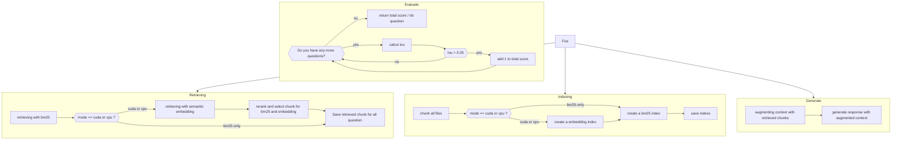

*This project has been created as part of the 42 curriculum by [login1], [login2].*

# RAG Against the Machine

## Table of Contents

- [Description](#description)


---

## Description

RAG against the machine est le projet qui fait suite, dans la logique, au projet [Call_Me_Maybe](https://github.com/MinePopTheReal/Call_Me_Maybe)
.

L'objectif de ce projet est de recréer un système de RAG (Retrieval-Augmented Generation).

Le principe du RAG est de permettre à un LLM (Large Language Model) de générer une réponse en s'appuyant sur des extraits pertinents provenant de documents externes. En effet, les LLM ne sont pas nécessairement entraînés sur les données ou les sujets spécifiques dont nous avons besoin.

Plutôt que de modifier ou de réentraîner le modèle, le RAG permet donc de rechercher les informations pertinentes dans une base documentaire et de les fournir au LLM comme contexte au moment de la génération de la réponse.

Ce projet a pour objectif de comprendre et de reproduire les différentes étapes nécessaires à la mise en place d'un tel système, de la récupération des documents jusqu'à la génération de la réponse.

## System Architecture


> **Note:** the exact merge/deduplication logic for the two candidate pools should be double-checked against the actual implementation before submission — the diagram above describes the intended behavior at the architectural level.

### Execution modes

The `RetrieverPipeline` is driven by a small `fire`-based CLI exposing three modes. This is a deliberate architectural decision, not a hardware auto-detection: which components run is configured explicitly, and is never inferred silently from whatever hardware happens to be available (see [Design Decisions](#design-decisions)).

| Mode | BM25 | Semantic embeddings | Re-ranking | mode |
|---|---|---|---|---|
| `bm25` | ✅ | ❌ | ❌ | CPU only, no model loaded |
| `cpu` | ✅ | ✅ (OpenVINO, INT8 quantized) | ✅ | CPU |
| `gpu` | ✅ | ✅ (PyTorch, fp16) | ✅ | CUDA |

Because the `bm25` mode never instantiates `SentenceTransformer` or `CrossEncoder`, it starts almost instantly and needs no embedding model on disk — useful as a fast baseline and for environments where downloading model weights isn't practical.

## Chunking Strategy


## Retrieval Method


## Design Decisions

- **Hybrid retrieval (BM25 + embeddings) rather than a single method.** Neither retriever alone covers both target file types well: BM25 misses paraphrased or conceptual documentation queries, while pure semantic search underperforms on exact code-identifier matches. Combining both, then re-ranking the merged pool, gives the system a shot at both recall targets.
- **ABC + Template Method for `Indexer` and `Retriever`.** This keeps the orchestration logic (in `RetrieverPipeline`) completely decoupled from the specifics of each retrieval strategy, makes each implementation independently testable, and makes the system open to adding new retrieval strategies later without modifying existing code.
- **Explicit CLI feature flags (`use_semantic`, `use_reranking`) instead of code comments or implicit hardware detection.** mode detection (is a GPU physically present?) is a runtime *observation*; which components the pipeline runs is an explicit *configuration* decision. Conflating the two — for example, silently switching to GPU mode "if available" — would make the pipeline's behavior depend on whatever machine happens to run it, which is undesirable when the same code needs to behave predictably during grading. Comments were avoided in favor of these flags being self-documenting and directly testable.
- **OpenVINO INT8 static quantization for the `cpu` mode.** Since the evaluation environment cannot be assumed to have a GPU, and OpenVINO is Intel's own toolkit purpose-built to accelerate and quantize models on Intel CPUs, this was the natural choice to keep semantic search usable without GPU acceleration, trading a small amount of numerical precision for a meaningful CPU speedup.
- **Local LLM generation via Ollama** rather than a hosted API. This removes any dependency on network access or API keys during evaluation, and keeps generation latency and behavior fully under local control.
- **`cached_property` for lazy loading of heavy models.** `SentenceTransformer` and `CrossEncoder` are only instantiated the first time they are actually accessed. This keeps the `bm25` mode fast to start (it never touches these models at all) without needing separate code paths to skip model loading.

## Challenges Faced

Several non-obvious bugs were found and fixed during development. The most instructive ones are documented below, since some produced no error at all — only quietly wrong results.

| Issue | Root cause | Fix |
|---|---|---|
| Wrong character indices when saving chunks | The cursor used to search for the next chunk's start was set to the *end* of the previous chunk, which broke as soon as `chunk_overlap > 0` | Search from the previous chunk's *start* index instead |
| Re-ranker returning the worst chunks instead of the best | `sorted()` was called without `reverse=True`, so candidates were sorted ascending by relevance score | Add `reverse=True`; explained a large, previously unexplained score discrepancy |
| Memory leak during querying | The quantized model was reloaded from disk on every single query instead of once | Move model loading into `__init__`, so it happens once per pipeline instance |
| Quantized model exported but never used | `export_static_quantized_openvino_model` wrote the quantized weights to disk, but the original unquantized model was still being used for encoding | Load the exported quantized artifact for inference instead of the original model |
| Silent file exclusion | An extension filter (`{"py", "txt", "md"}`) silently dropped many file types the chunker actually supported | Widen/derive the filter from the chunker's actual supported extensions |
| FAISS search failing on a single query | `SentenceTransformer.encode()` returns a 1-D array for a single string input, but FAISS search expects a 2-D batch | Wrap the query in a list before encoding, and unwrap the single result with `[0]` at the call site (kept out of the lower-level method to preserve its typed contract) |
| Shape mismatch feeding candidates to the re-ranker | `_retrieving([query], k)` returns `list[list[int]]` (a batch of one), which was passed directly to the re-ranker instead of being unwrapped | Extract the single-query batch with `[0]` before re-ranking |
| OpenVINO model failing to load | Missing `config.json` produced `ValueError: Unrecognized model`, because the quantized file lives inside an `openvino/` subdirectory | Locate the quantized artifact with `rglob()` instead of a hardcoded path |
| `RuntimeError: No space left on mode` | Repeated export attempts accumulated large, unused model artifacts in the Hugging Face cache | Environment/disk-management issue rather than a code bug; resolved by clearing the cache |

## Instructions

### Prerequisites

- Python (version pinned in `pyproject.toml`)
- [`uv`](https://docs.astral.sh/uv/) as the package manager
- [Ollama](https://ollama.com/) installed locally, with at least one model pulled (e.g. `ollama pull <model-name>`)
- (Optional, `gpu` mode only) a CUDA-capable GPU with a working PyTorch/CUDA install

### Installation

```bash
git clone <repository-url>
cd RAG
uv sync
```

`uv sync` installs all dependencies declared in `pyproject.toml` / `uv.lock` into a local virtual environment.

### Running the pipeline

> **The exact entry-point name and flags below are illustrative — replace them with your actual `fire`-exposed command before submitting.**

```bash
# Lexical-only baseline, no model loading, fastest to start
uv run python <entrypoint>.py bm25 --query "How does the Chunker split code files?"

# Hybrid retrieval + re-ranking on CPU (OpenVINO INT8)
uv run python <entrypoint>.py cpu --query "How does the Chunker split code files?"

# Hybrid retrieval + re-ranking on GPU (fp16)
uv run python <entrypoint>.py gpu --query "How does the Chunker split code files?"
```

## Example Usage

```bash
$ uv run python <entrypoint>.py cpu --query "Where is the FAISS index built?"

Retrieved 5 chunks (BM25 + embeddings, re-ranked)
Top match: indexer.py — IndexerSemanticEmbedding._build_index (score: 0.87)
...

Answer:
The FAISS index is built inside `IndexerSemanticEmbedding._build_index`,
which wraps a `faiss.IndexFlatIP` populated with L2-normalized embeddings
produced by the SentenceTransformer model.
```

**[Replace the example above with a real captured run of your CLI before submitting.]**

## Resources

### References

- Lewis, P. et al. (2020). *Retrieval-Augmented Generation for Knowledge-Intensive NLP Tasks.* — the original RAG paper. [arXiv:2005.11401](https://arxiv.org/abs/2005.11401)
- Robertson, S. & Zaragoza, H. (2009). *The Probabilistic Relevance Framework: BM25 and Beyond.* — the theoretical foundation for the BM25 ranking function.
- Reimers, N. & Gurevych, I. (2019). *Sentence-BERT: Sentence Embeddings using Siamese BERT-Networks.* — the bi-encoder/cross-encoder architecture behind `sentence-transformers`. [arXiv:1908.10084](https://arxiv.org/abs/1908.10084)
- Johnson, J., Douze, M. & Jégou, H. (2017). *Billion-scale similarity search with GPUs.* — the paper behind FAISS. [arXiv:1702.08734](https://arxiv.org/abs/1702.08734)
- [`bm25s` documentation](https://github.com/xhluca/bm25s) — the BM25 implementation used for lexical indexing.
- [`sentence-transformers` documentation](https://www.sbert.net/) — bi-encoder and cross-encoder models.
- [FAISS documentation](https://faiss.ai/) — vector index library.
- [OpenVINO documentation](https://docs.openvino.ai/) and [`optimum-intel`](https://github.com/huggingface/optimum-intel) — CPU model quantization and inference.
- [Ollama documentation](https://github.com/ollama/ollama) — local LLM inference.
- [LangChain `RecursiveCharacterTextSplitter` reference](https://python.langchain.com/docs/how_to/recursive_text_splitter/) — conceptual reference for the chunking strategy.

### AI Usage Disclosure

An AI assistant (Claude, by Anthropic) was used during this project as a **debugging and design-discussion aid**, specifically for:

- Diagnosing the root cause of several of the bugs listed in [Challenges Faced](#challenges-faced) (e.g. the missing `reverse=True`, the FAISS 1-D/2-D shape mismatch), based on symptoms and code shared during the conversation.
- Discussing architectural options (e.g. the ABC + Template Method pattern for `Indexer`/`Retriever`) and their trade-offs.
- Reviewing `mypy --strict` typing issues and suggesting where fixes should live (call site vs. lower-level method).
- Drafting and structuring this README.

All code, the final architecture, and all technical decisions were written and validated by the project author(s); AI-generated suggestions were reviewed critically before being incorporated, and several invented or incorrect suggestions were identified and rejected during that review process.

<!--
Author checklist before submission — remove this comment once done:
- [ ] Replace [login1], [login2] on the very first line with your actual 42 login(s)
- [ ] Fill in the "Achieved recall@k" column and latency numbers in Performance Analysis
- [ ] Replace <entrypoint>.py and CLI flags in Instructions / Example Usage with your real command
- [ ] Double-check the candidate-pool merge/dedup description in System Architecture against your actual code
- [ ] Add the real repository URL in Instructions > Installation
- [ ] Double-check the AI Usage Disclosure accurately reflects how AI was actually used on this project
-->


<!-- ```text
<|im_start|>system
{sont but}<|im_end|>
<|im_start|>user
{message utilisateur}<|im_end|>
<|im_start|>assistant
{reponse du model}<|im_end|>
<|im_start|>user
{message utilisateur}<|im_end|>
```

## Instructions


## Ressources
[Python Fire guide](https://google.github.io/python-fire/guide/)
[Best Matching 25 doc](https://www.geeksforgeeks.org/nlp/what-is-bm25-best-matching-25-algorithm/)
[Rag Blog](https://blog.stephane-robert.info/docs/developper/programmation/python/rag-introduction/)
[RAG doc](https://docs.langchain.com/oss/python/deepagents/rag#index-langchain-documentation)
[Langchain doc](https://docs.langchain.com/oss/python/deepagents/rag#load-documents)
[Langchain doc 2](https://docs.langchain.com/oss/python/integrations/splitters/code_splitter)
[Opening files recursively doc](https://www.geeksforgeeks.org/python/how-to-iterate-over-files-in-directory-using-python/) -->